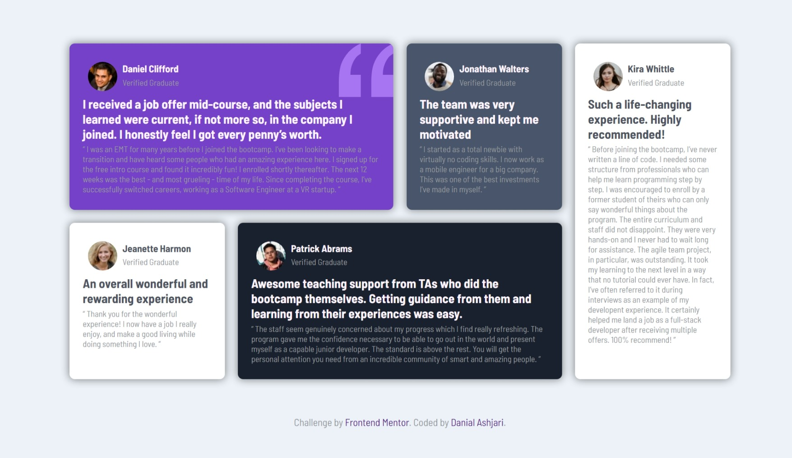

# Frontend Mentor - Testimonials grid section solution

This is a solution to the [Testimonials grid section challenge on Frontend Mentor](https://www.frontendmentor.io/challenges/testimonials-grid-section-Nnw6J7Un7). Frontend Mentor challenges help you improve your coding skills by building realistic projects.

## Table of contents

- [Overview](#overview)
  - [The challenge](#the-challenge)
  - [Screenshot](#screenshot)
  - [Links](#links)
- [My process](#my-process)
  - [Built with](#built-with)
  - [What I learned](#what-i-learned)
  - [Continued development](#continued-development)
- [Author](#author)

## Overview

### The challenge

Users should be able to:

- View the optimal layout for the site depending on their device's screen size
- Use grid to place objects in a page

### Screenshot




### Links

- Solution URL: [Add solution URL here](https://your-solution-url.com)
- Live Site URL: [Add live site URL here](https://your-live-site-url.com)

## My process

### Built with

- HTML5
- Flexbox
- CSS Grid
- Mobile-first workflow
- SCSS

### What I learned

Here i used grid to change the place of the object

```scss
  @include grid-columns(4,25px);
  margin: rem(50) rem(100);
  .box1{
    grid-column: 1/3;
  }
  .box4{
  grid-column: 2/4;
  }
  .box5{
    grid-row: 1/3;
    grid-column: 4/4;
  }
  
```

### Continued development

I'm going to continue my learning path provided by frontend mentor and start reviewing js and do more complicated projects.

## Author

- GitHub - [Danial Ashjari](https://github.com/danielashjari)
- Frontend Mentor - [@danielashjari](https://www.frontendmentor.io/profile/danielashjari)
- x - [@danielashjari](https://www.x.com/danielashjari)
